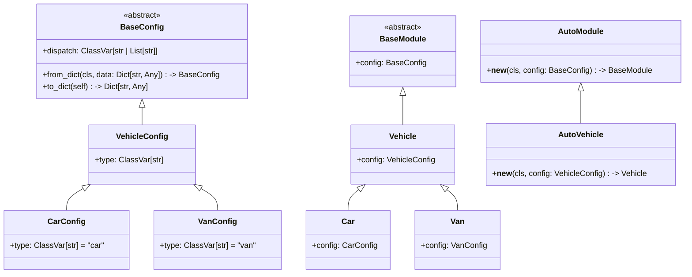

# Nightjar

[](https://badge.fury.io/py/nightjar) 


## Description

This project is a Python package that provides a simple way to create objects of different types based on a configuration object. The package is inspired by how `huggingface/transformers` package creates different types of models based on a configuration object. The package provides a base class `BaseModule` that can be subclassed to create different class types. Each class type is defined by a configuration class that inherits from `BaseConfig`. The `AutoModule` class is used to automatically create instances of the correct object type based on the configuration. The `dispatch` attribute of the configuration class is used to specify the static attribute that determines the object type.

## Installation

To install this package, run the following command:

```bash
pip install nightjar
```

## Usage

To use this package, you can import the package and use it as follows:



### Explanation

This package provides a base class `BaseModule` that can be subclassed to create different types of objects. Each object type is defined by a configuration class that inherits from `BaseConfig`. The `AutoModule` class is used to automatically create instances of the correct object type based on the configuration. The `dispatch` attribute of the configuration class is used to specify the static attribute that determines the object type.

`AutoModule` is a generic class that takes the configuration object as init argument and returns an instance of the correct object type. The `__new__` method is used to create the correct object type based on the configuration. It is not necessary to define the `__new__` method in the subclass of `AutoModule` or to subclass `AutoModule` at all. The `AutoModule` class can be used directly to create instances of the correct object type. However, subclassing `AutoModule` can be useful to add additional functionality or to customize the creation of objects and for type hinting.

```python
# use from_dict method to create a configuration object from a dictionary this will automatically create the correct jar config.
config = VehicleConfig.from_dict({"type": "car"})
# Now you can create a car object using the configuration object with Auto* object
car = AutoVehicle(config)
# Now you can access the config object
assert car.config.type == "car", f"expected 'car', got '{car.config.type}'"
```

You could use `AutoJar`, `Jar`, `JarConfig` instead of `AutoModule`, `BaseModule`, `BaseConfig` respectively if you prefer.

## License
Please see the [MIT License](LICENSE) file for details.